# Charming - A Rust Visualization Library

[](https://crates.io/crates/charming)
[](https://docs.rs/charming)
[](https://discord.gg/u3wmVPcW)

Charming is a powerful and versatile chart rendering library for Rust that leverages the power of [Apache ECharts](https://echarts.apache.org/en/index.html) to deliver high-quality data visualizations. Built with the Rust programming language, this library aims to provide the Rust ecosystem with an intuitive and effective way to generate and visualize charts, using a declarative and user-friendly API.

Highlights:

- Easy-to-use, declaritive API.
- Abundant chart types with rich and customizable chart themes and styles.
- Ready to use in WebAssembly environments.
- Rendering to multiple formats, including HTML, SVG, PNG, JPEG, GIF, WEBP, PNM, TIFF, TGA, DDS, BMP, ICO, HDR, OPENEXR, FARBFELD, AVIF, and QOI.

## Themes

<table>
    <tr>
        <td>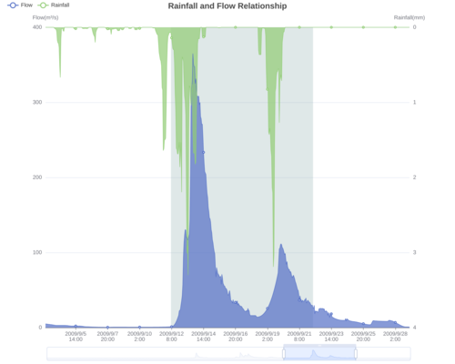<p align="center">Default</p></td>
        <td>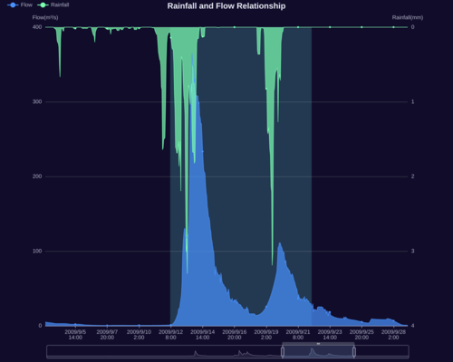<p align="center">Dark</p></td>
        <td>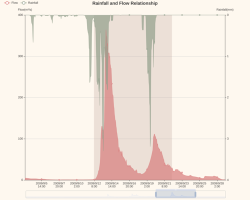<p align="center">Vintage</p></td>
    </tr>
    <tr>
        <td>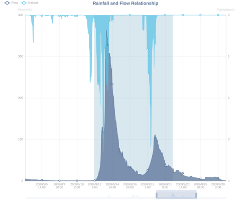<p align="center">Vintage</p></td>
        <td>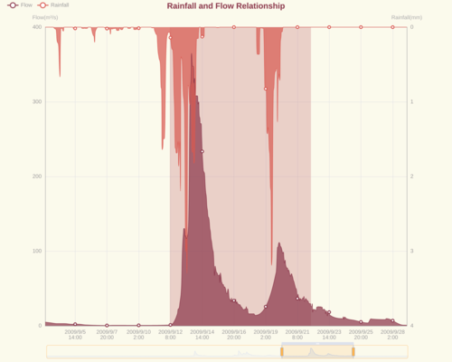<p align="center">Essos</p></td>
        <td>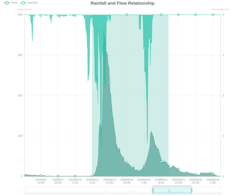<p align="center">Essos</p></td>
    </tr>
    <tr>
        <td>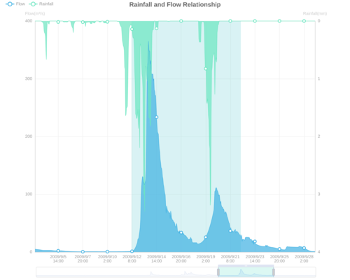<p align="center">Walden</p></td>
        <td>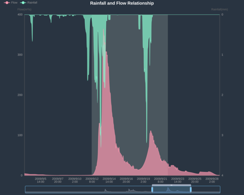<p align="center">Chalk</p></td>
        <td>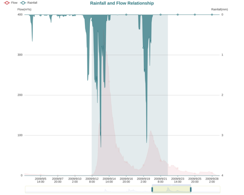<p align="center">Infographic</p></td>
    </tr>
    <tr>
        <td>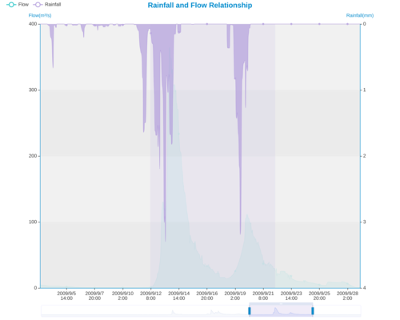<p align="center">Macarons</p></td>
        <td>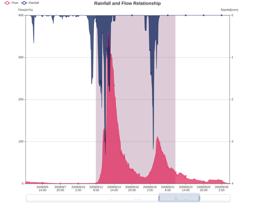<p align="center">Roma</p></td>
        <td>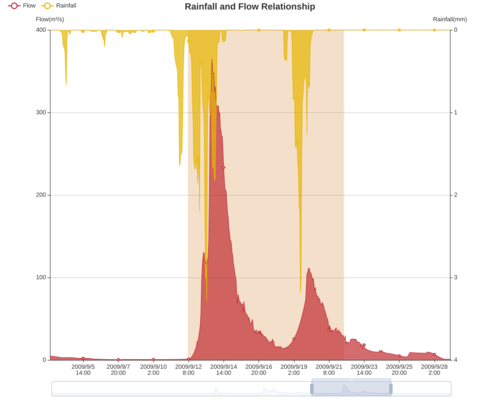<p align="center">Shine</p></td>
    </tr>
    <tr>
        <td>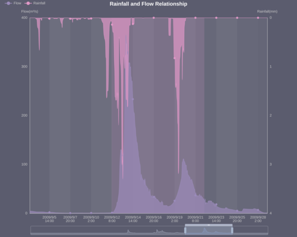<p align="center">Purple Passion</p></td>
        <td>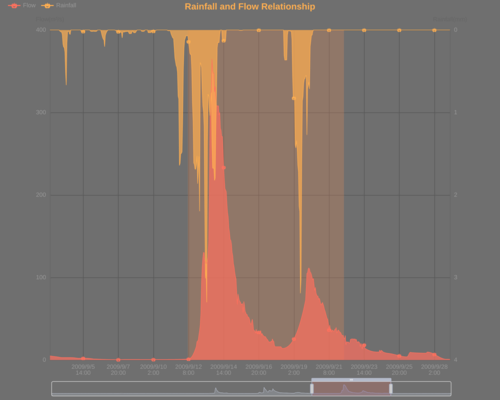<p align="center">Halloween</p></td>
    </tr>
</table>

Future versions of Charming will support custom themes.

## Basic Usage

Add charming as a dependency:

```sh
$ cargo add charming
```

Refer to the documentation of the [`Chart`](https://docs.rs/charming/latest/charming/struct.Chart.html) struct for how to create a chart with various components.

Once you create a chart, you can render it into various format. Charming provides three types of renderers:

- **HTML renderer**: `HtmlRenderer` renders a chart into an HTML fragments and offloads the actual rendering to user's web browser for an interactive, seamless experience. This renderer is useful when you want to render a chart on the client side, e.g., in a web application.
- **Image renderer**: `ImageRenderer` renders a chart into an image file. This renderer makes use of an embed [deno_core](https://github.com/denoland/deno_core) engine to execute the JavaScript code of Echarts and generate an image file. This renderer is disabled by default, and you need to enable the `ssr` (Server-Side Rendering) feature to use it.
- **WASM renderer**: `WasmRenderer` renders a chart in a WebAssembly runtime. This renderer is disabled by default, and you need to enable the `wasm` feature to use it. **Note that the `wasm` feature and `ssr` feature are mutually exclusive**.

Here is an example of drawing a simple pie chart into an SVG file:

```rust
use charming::{
    component::Legend,
    element::ItemStyle,
    series::{Pie, PieRoseType},
    Chart, ImageRenderer
};

fn main() {
    let chart = Chart::new()
        .legend(Legend::new().top("bottom"))
        .series(
            Pie::new()
                .name("Nightingale Chart")
                .rose_type(PieRoseType::Radius)
                .radius(vec!["50", "250"])
                .center(vec!["50%", "50%"])
                .item_style(ItemStyle::new().border_radius(8))
                .data(vec![
                    (40.0, "rose 1"),
                    (38.0, "rose 2"),
                    (32.0, "rose 3"),
                    (30.0, "rose 4"),
                    (28.0, "rose 5"),
                    (26.0, "rose 6"),
                    (22.0, "rose 7"),
                    (18.0, "rose 8"),
                ]),
        );

    let mut renderer = ImageRenderer::new(1000, 800);
    renderer.save(&chart, "/tmp/nightingale.svg");
}
```

This code creates the following SVG file:


As another example, the code file [gallery/src/dataset/encode_and_matrix.rs](./gallery/src/dataset/encode_and_matrix.rs) draws a complex chart with four sub-charts:

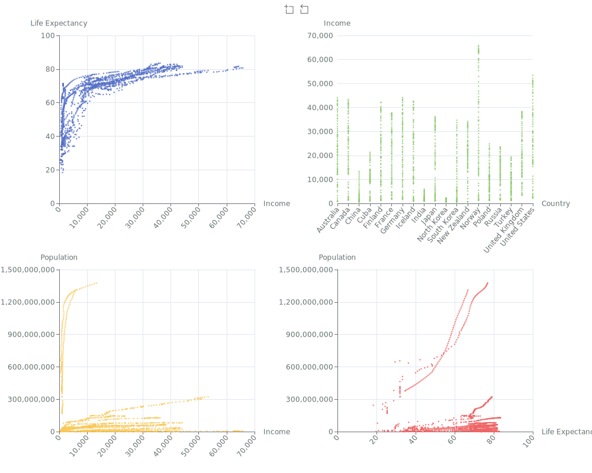

### Crate Feature Flags

The following two feature flags are available, **note that they can't be used together**:

- `ssr` - Enables the `ImageRenderer`, which provides the capability to generate image files.
- `wasm` - Enables the `WasmRenderer`, which provides the capability to render charts in WebAssembly runtime.

### Renderers

```rs
// Use HtmlRenderer.
use charming::HtmlRenderer;

// Chart dimension 1000x800.
let renderer = HtmlRenderer::new("my charts", 1000, 800);
// Render the chart as HTML string.
let html_str = renderer.render(&chart).unwrap();
// Save the chart as HTML file.
renderer.save(&chart, "/tmp/chart.html").unwrap();


// Use ImageRenderer. The `ssr` feature needs to be enabled.
use charming::{ImageRenderer, ImageFormat};

// Chart dimension 1000x800.
let mut renderer = ImageRenderer::new(1000, 800);
// Render the chart as SVG string.
renderer.render(&chart).unwrap();
// Render the chart as PNG bytes.
renderer.render_format(ImageFormat::Png, &chart).unwrap();
// Save the chart as SVG file.
renderer.save(&chart, "/tmp/chart.svg").unwrap();
// Save the chart as PNG file.
renderer.save_format(ImageFormat::Png, &chart, "/tmp/chart.png");


// Use WasmRenderer. The `wasm` feature needs to be enabled.
use charming::WasmRenderer;

// Chart dimension 1000x800.
let renderer = WasmRenderer::new(1000, 800);
// Render the chart in the WebAssembly runtime
renderer.render(&chart).unwrap();
```

### Themes

Charming supports a number of themes out of the box. You can use the `Theme` enum to specify a theme for your chart. For instance, the following code snippet shows how to use the `Westeros` theme:

```rust
use charming::{Chart, ImageRenderer};
use charming::theme::Theme;
use charming::component::Title;

ImageRenderer::new(1000, 800).theme(Theme::Westeros).save(
    &Chart::new().title(Title::new().text("Westeros")),
    "/tmp/westeros.svg",
);
```

Future versions of Charming will support custom themes.

## Gallery

Here are some selected chart examples. Click on any single chart to view its source code file.

You can also clone the repo and run `cargo run --bin gallery` to view the interactive charts on the rendered HTML page.

### Bar Charts

<div align="center">
<a href="./gallery/src/bar/bar_with_background.rs">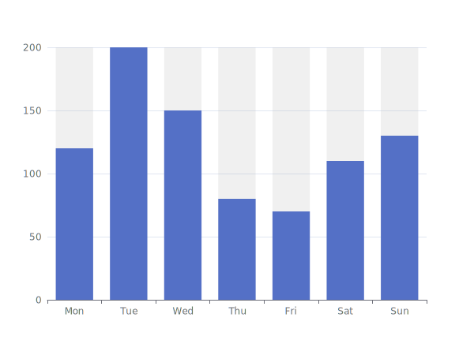</a>
<a href="./gallery/src/bar/basic_bar.rs">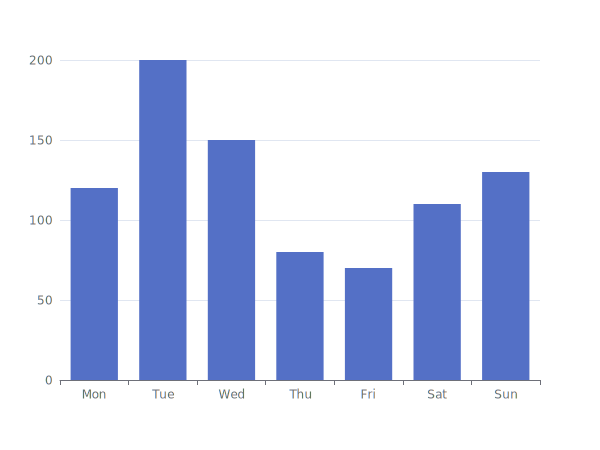</a>
<a href="./gallery/src/bar/radial_polar_bar_label_position.rs">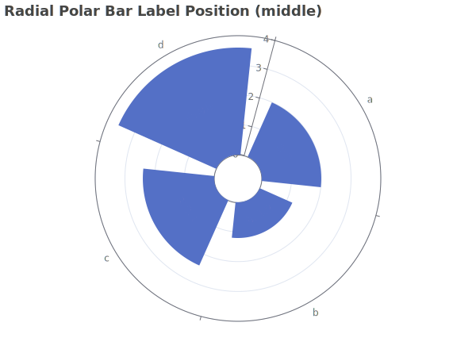</a>
<a href="./gallery/src/bar/set_style_of_single_bar.rs">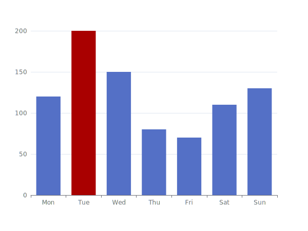</a>
<a href="./gallery/src/bar/stacked_column.rs">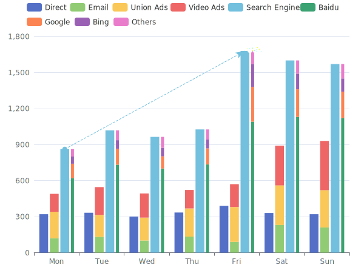</a>
<a href="./gallery/src/bar/tangential_polar_bar.rs">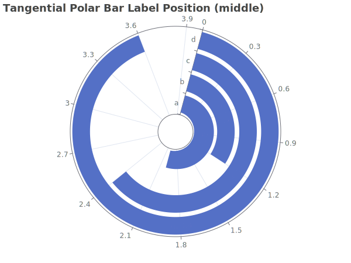</a>
<a href="./gallery/src/bar/waterfall.rs">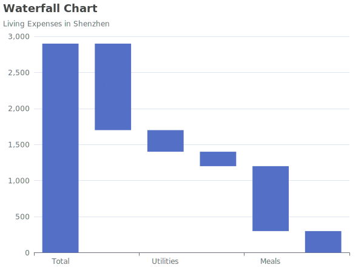</a>
<a href="./gallery/src/bar/world_population.rs">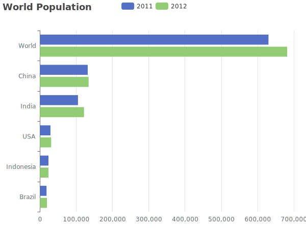</a>
</div>

### Boxplot Charts

<div align="center">
<a href="./gallery/src/boxplot/boxplot_light_velocity.rs">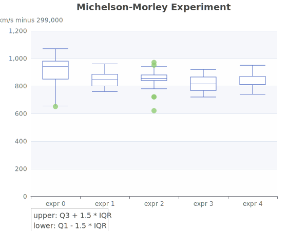</a>
<a href="./gallery/src/boxplot/multiple_categories.rs">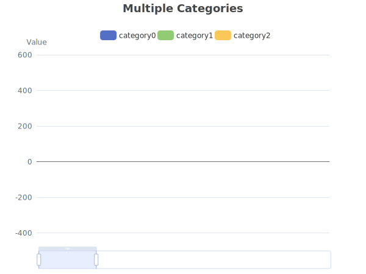</a>
</div>

### Candlestick Charts

<div align="center">
<a href="./gallery/src/candlestick/basic_candlestick.rs">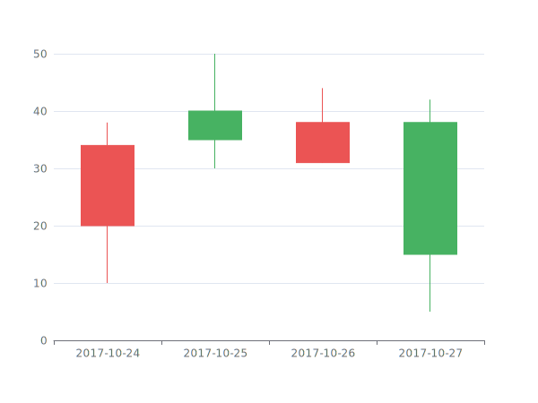</a>
<a href="./gallery/src/candlestick/shanghai_index.rs">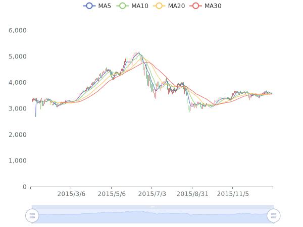</a>
</div>

### Funnel Charts

<div align="center">
<a href="./gallery/src/funnel/funnel_chart.rs">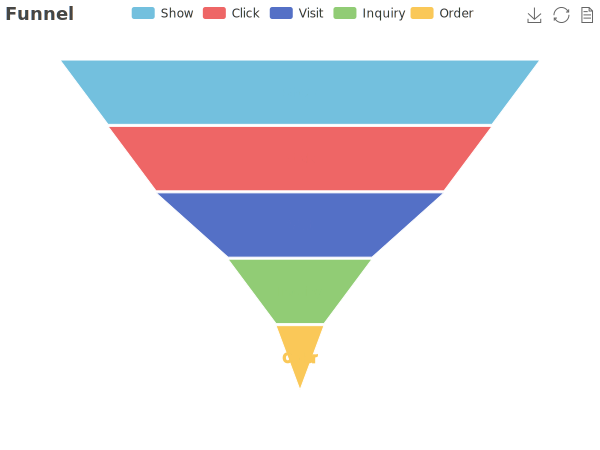</a>
<a href="./gallery/src/funnel/multiple_funnels.rs">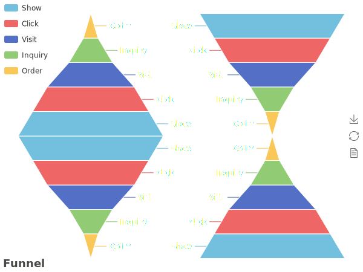</a>
</div>

### Gauge Charts

<div align="center">
<a href="./gallery/src/gauge/gauge_barometer.rs">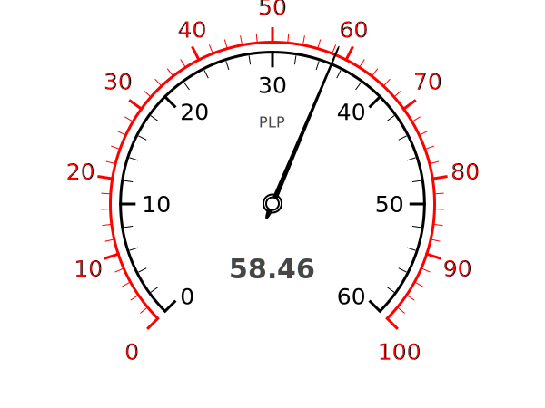</a>
<a href="./gallery/src/gauge/gauge_basic.rs">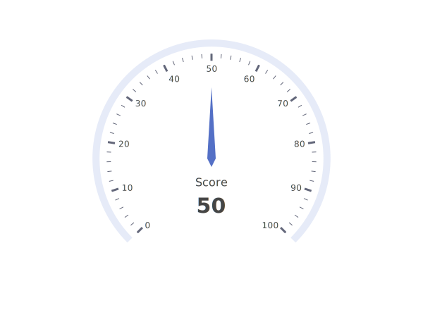</a>
<a href="./gallery/src/gauge/gauge_simple.rs">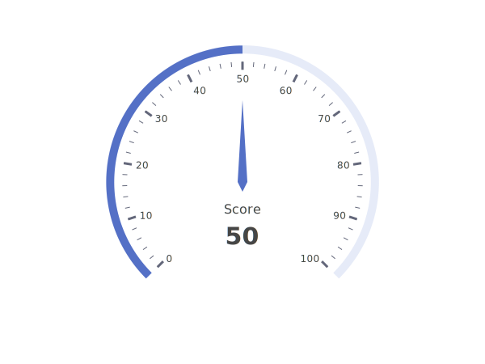</a>
</div>

### Graph Charts

<div align="center">
<a href="./gallery/src/graph/hide_overlapped_label.rs">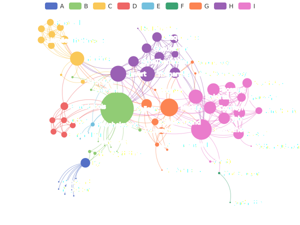</a>
<a href="./gallery/src/graph/les_miserables.rs">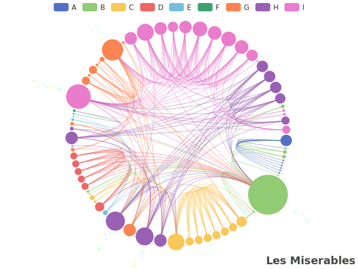</a>
</div>

### Heatmap Charts

<div align="center">
<a href="./gallery/src/heatmap/heatmap_on_cartesian.rs">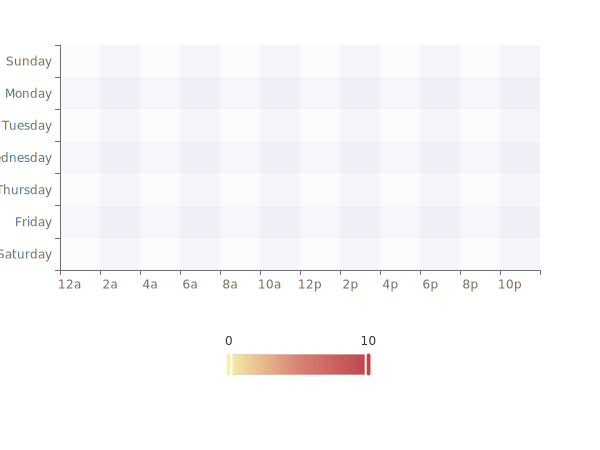</a>
</div>

### Line Charts

<div align="center">
<a href="./gallery/src/line/area_pieces.rs">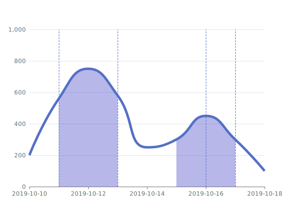</a>
<a href="./gallery/src/line/basic_area.rs">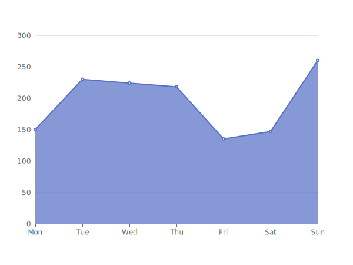</a>
<a href="./gallery/src/line/basic_line.rs">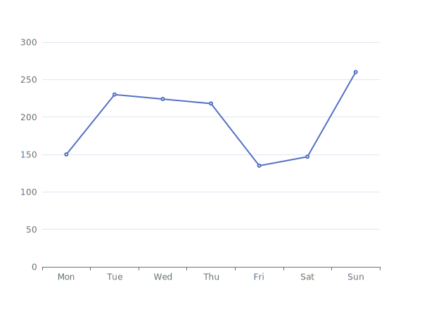</a>
<a href="./gallery/src/line/confidence_band.rs">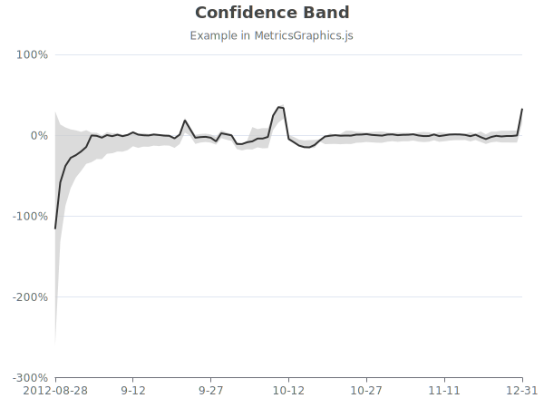</a>
<a href="./gallery/src/line/data_transform_filter.rs">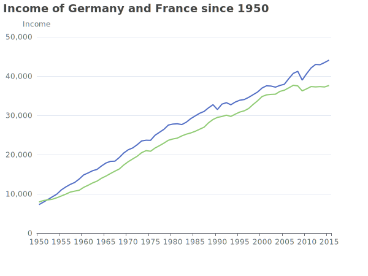</a>
<a href="./gallery/src/line/distribution_of_electricity.rs">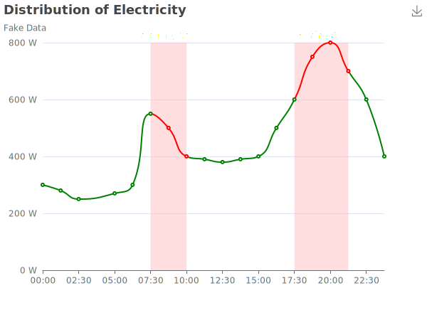</a>
<a href="./gallery/src/line/gradient_stacked_area.rs">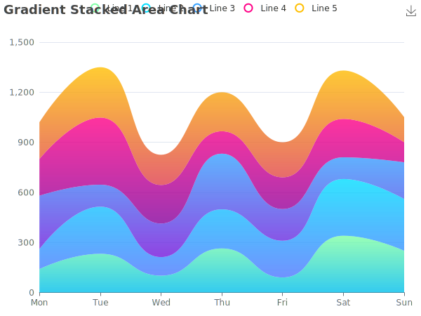</a>
<a href="./gallery/src/line/large_scale_area.rs">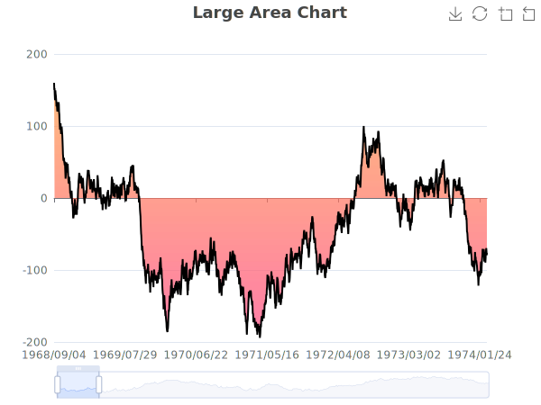</a>
<a href="./gallery/src/line/line_gradient.rs">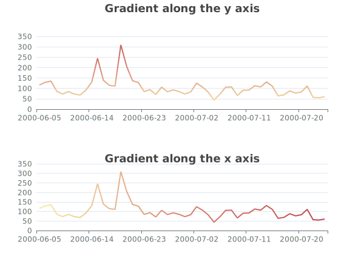</a>
<a href="./gallery/src/line/rainfall.rs">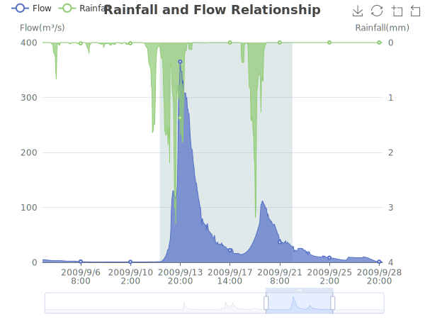</a>
<a href="./gallery/src/line/rainfall_vs_evaporation.rs">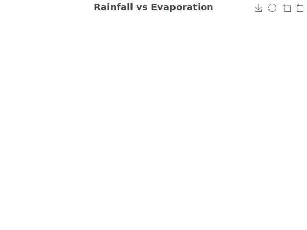</a>
<a href="./gallery/src/line/smoothed_line.rs">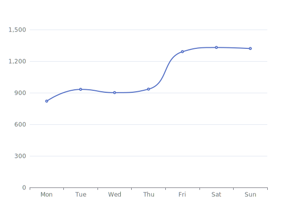</a>
<a href="./gallery/src/line/stacked_area.rs">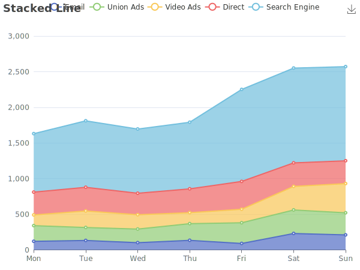</a>
<a href="./gallery/src/line/stacked_line.rs">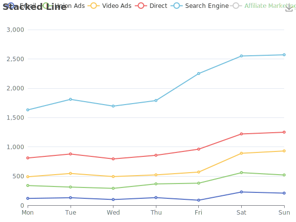</a>
<a href="./gallery/src/line/temperature_change.rs">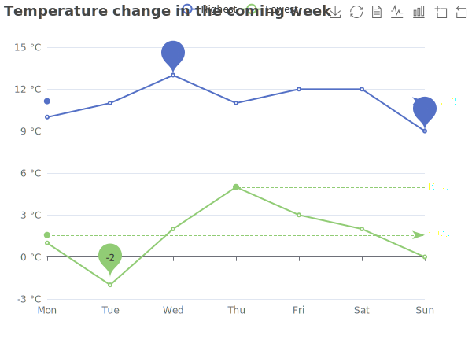</a>
<a href="./gallery/src/line/two_value_axes_in_polar.rs"></a>
</div>

### Parallel Charts

<div align="center">
<a href="./gallery/src/parallel/basic_parallel.rs"></a>
<a href="./gallery/src/parallel/parallel_aqi.rs"></a>
</div>

### Pie Charts

<div align="center">
<a href="./gallery/src/pie/doughnut_chart_with_rounded_corner.rs"></a>
<a href="./gallery/src/pie/nightingale.rs"></a>
<a href="./gallery/src/pie/referer_of_a_website.rs"></a>
</div>

### Radar Charts

<div align="center">
<a href="./gallery/src/radar/basic_radar.rs"></a>
<a href="./gallery/src/radar/multiple_radar.rs"></a>
<a href="./gallery/src/radar/proportion_of_browsers.rs"></a>
</div>

### Sankey Charts

<div align="center">
<a href="./gallery/src/sankey/basic_sankey.rs"></a>
<a href="./gallery/src/sankey/node_align_left_sankey.rs"></a>
<a href="./gallery/src/sankey/sankey_orient_vertical.rs"></a>
</div>

### Scatter Charts

<div align="center">
<a href="./gallery/src/scatter/anscombe_quartet.rs"></a>
<a href="./gallery/src/scatter/basic_scatter.rs"></a>
<a href="./gallery/src/scatter/bubble_chart.rs"></a>
<a href="./gallery/src/scatter/effect_scatter.rs"></a>
<a href="./gallery/src/scatter/punch_card_of_github.rs"></a>
</div>

### Sunburst Charts

<div align="center">
<a href="./gallery/src/sunburst/drink_flavors.rs"></a>
</div>

### Theme River Charts

<div align="center">
<a href="./gallery/src/theme_river/theme_river_lastfm.rs"></a>
</div>

### Tree Charts

<div align="center">
<a href="./gallery/src/tree/from_left_to_right_tree.rs"></a>
<a href="./gallery/src/tree/multiple_trees.rs"></a>
</div>
